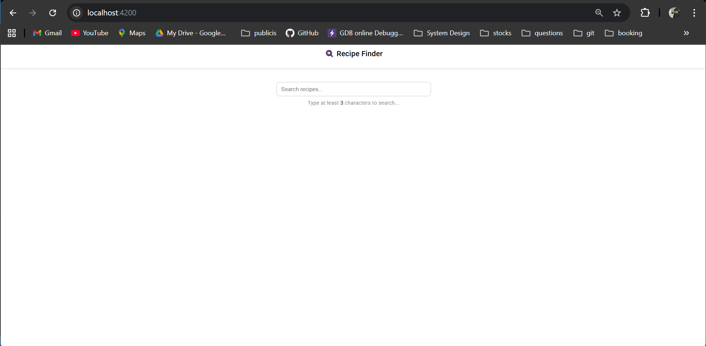
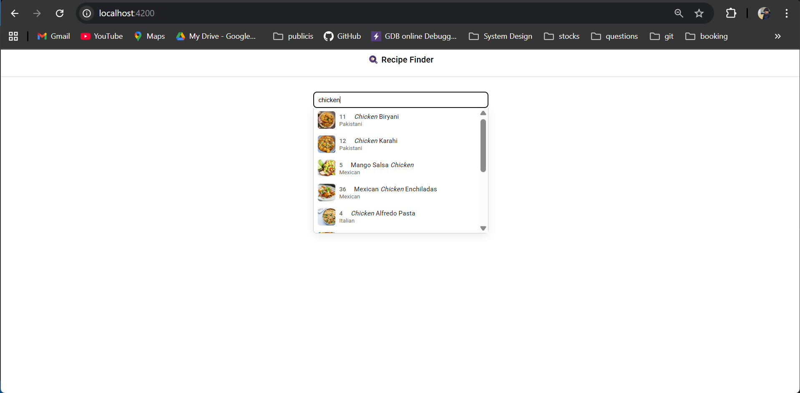
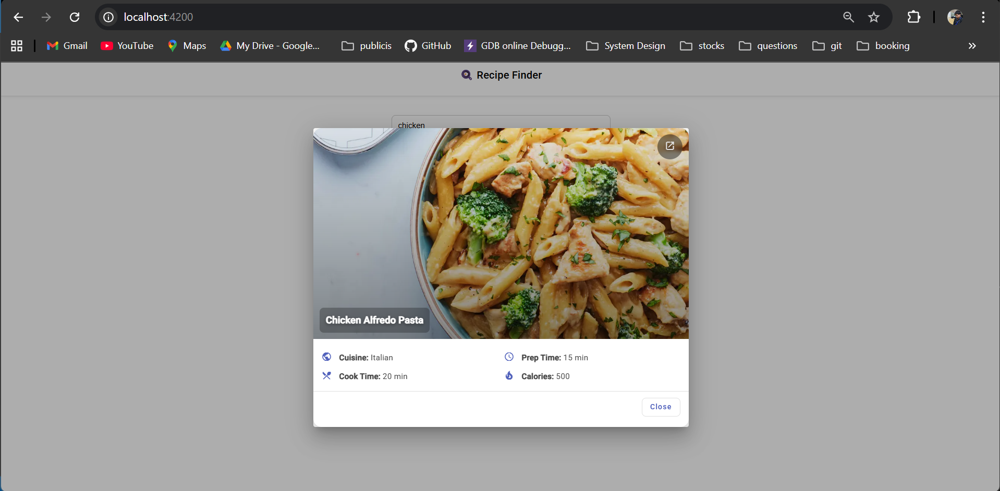
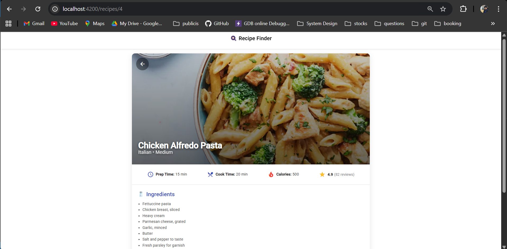
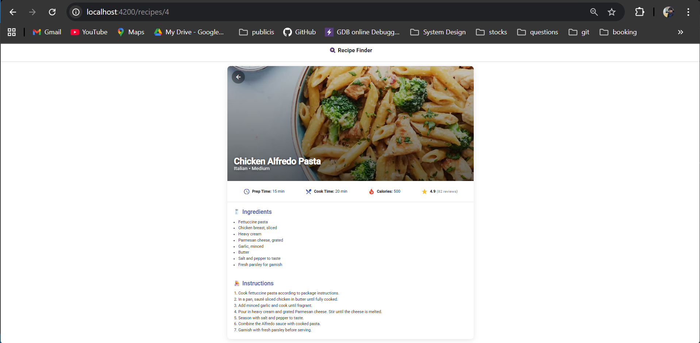

# 🍽️ Recipes Finder - Angular Frontend

This is the **frontend UI** for the *Recipes Finder App*, built using **Angular** and **Angular Material**.  
It allows users to **search recipes**, view **suggestions dynamically** (typeahead), and open a **modal or full-page view** for recipe details.

---

## 🚀 Features

- 🔍 **Dynamic search bar** with typeahead and debounce (min 3 characters)
- ✨ **Highlighted search results** (fuzzy full-text search)
- 💡 **Responsive UI** with Angular Material components
- 📜 **Recipe details modal** with clean overlay design
- 🧭 **Full-page view** for extended recipe details
- ⚡ Smooth animations and subtle UI effects

---

## 🖼️ UI Screenshots

### 🔍 Search Screen
Search for recipes dynamically with highlighted results.

| Typing Search | Search Results |
|---------------|----------------|
|  |  |

---

### 🍲 Recipe Modal
Quick view of a recipe with essential details.



---

### 📖 Full Recipe Details
Explore complete recipe details, including ingredients, instructions, and ratings.

| Example 1 | Example 2 |
|------------|------------|
|  |  |

---

## 🏗️ Tech Stack

| Layer | Technology |
|-------|-------------|
| Framework | Angular 17 |
| UI Components | Angular Material |
| Styling | CSS3 (custom responsive layout) |
| Communication | REST API (Spring Boot backend) |
| Data Handling | RxJS + Observables |
| Build Tool | Angular CLI |

---

## ⚙️ Setup & Run Locally

### 1️⃣ Clone the repository
```bash
git clone https://github.com/shakya-rohit/recipes-frontend.git
cd recipes-frontend
```

### 2️⃣ Install dependencies
```bash
npm install
```

### 3️⃣ Run the Angular app
```bash
ng serve
```

Then open: [http://localhost:4200](http://localhost:4200)

---

## 🌐 API Integration

The app connects to the backend service:  
➡️ **[Recipes API - Spring Boot Backend](https://github.com/shakya-rohit/recipes-backend)**

Ensure your backend is running on port `8080` before starting the frontend.

---

## 🧩 Key Components

| Component | Description |
|------------|-------------|
| `search-bar` | Search bar with auto-suggestions and fuzzy matching |
| `recipe-details` | Modal component displaying recipe details |
| `recipe-full-page` | Full-page recipe view with additional info |
| `recipe.service.ts` | Handles communication with backend API |

---

## 🎨 UI Preview

### 🔍 Search Bar with Suggestions
Displays dropdown results after typing at least 3 characters.

### 🧾 Recipe Details Modal
Shows recipe name, cuisine, and nutritional details with a clean overlay and “Close” button.

### 🖥️ Full Page View
Expands recipe details with ingredients and instructions.

---

## 📁 Project Structure

```
src/app
├── components/
│   ├── search-bar/          → Search bar with typeahead
│   ├── recipe-details/      → Modal view for recipes
│   ├── recipe-full-page/    → Dedicated recipe page
├── services/
│   └── recipe.service.ts    → API communication layer
├── models/
│   └── recipe.model.ts      → Recipe type definition
└── app.module.ts            → Module configuration
```

---

## 🔗 Backend API Endpoints Used

| Method | Endpoint | Purpose |
|---------|-----------|----------|
| `GET` | `/api/recipes/search?query=` | Fetch filtered recipes |
| `GET` | `/api/recipes/{id}` | Fetch details of a single recipe |

---

## 💅 Design Highlights

- Modern, minimal interface using Material Design principles  
- Debounced search ensures efficient API calls  
- Responsive layout — works on desktop & mobile  
- Smooth transitions between modal and full-page view
